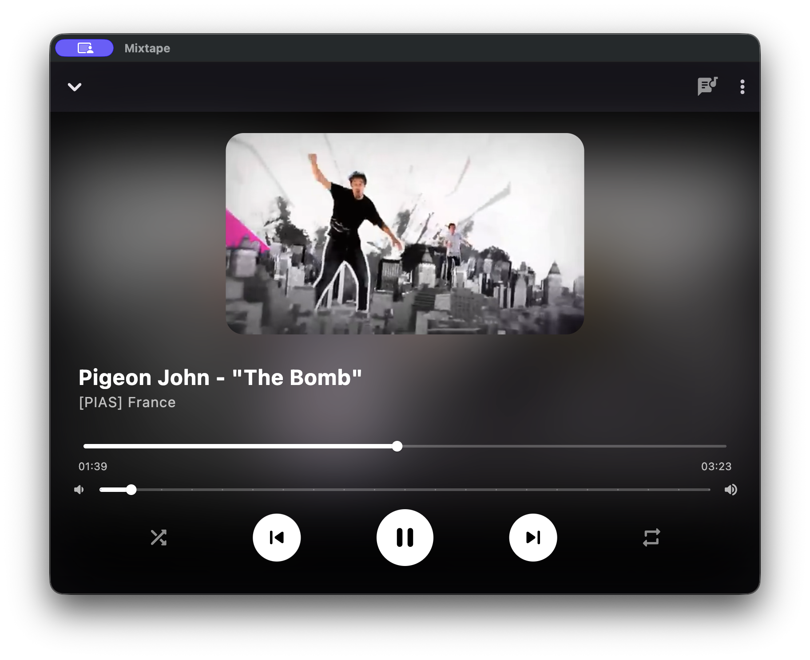
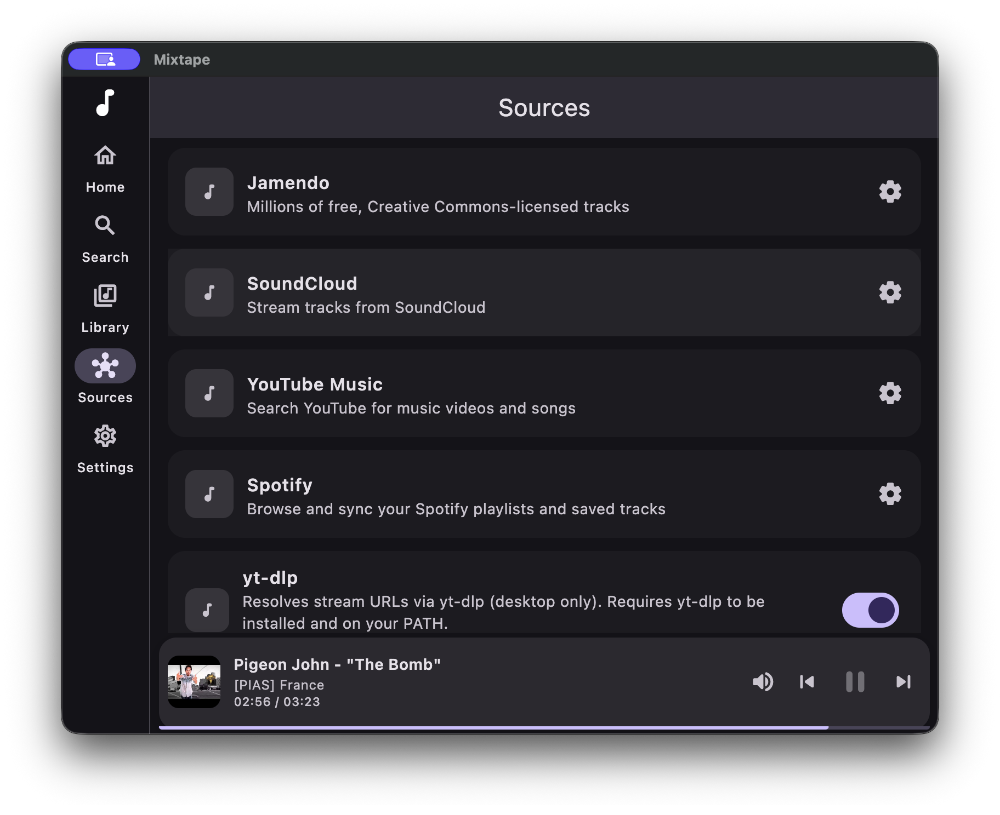
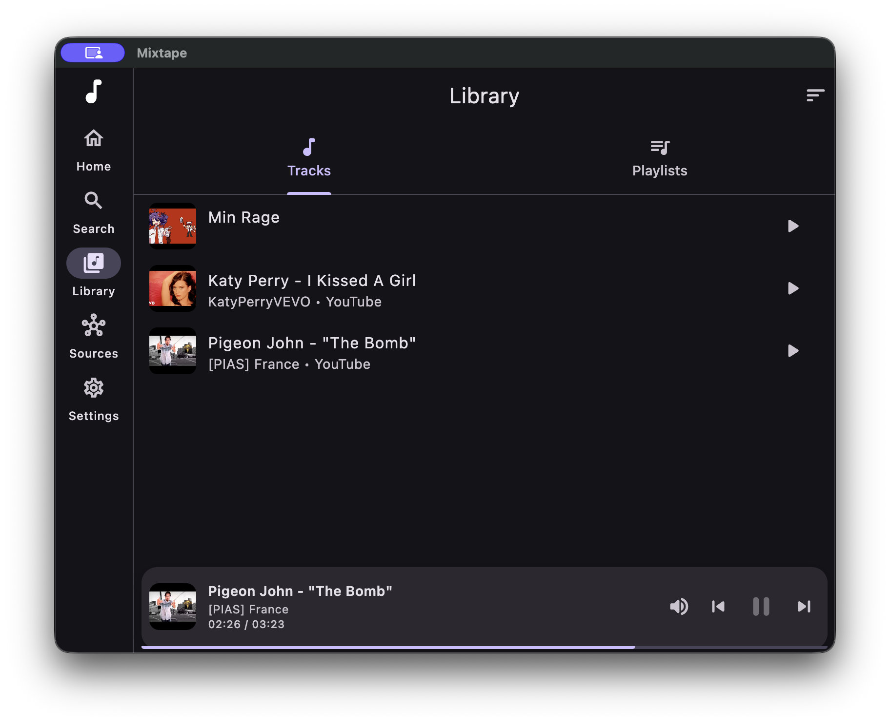

# mixtape

[](https://github.com/theDevJade/mixtape/actions/workflows/build.yml)
[](https://copr.fedorainfracloud.org/coprs/mixtape/mixtape/)
[](LICENSE)

Open source music player built with Flutter. Mix YouTube, SoundCloud, Spotify playlists, local files, and more in the same queue.

**Platforms:** iOS · Android · macOS · Windows · Linux

---

## Screenshots

| Now Playing | Sources | Menu |
|---|---|---|
|  |  |  |

---

## What it does

- Mix tracks from different sources in one queue
- Background playback with lock screen controls on mobile
- Discord Rich Presence on desktop, shows what you're playing in your status
- Synced lyrics from [lrclib.net](https://lrclib.net)
- Colors adapt to album art
- Playlists and queue saved locally with SQLite
- Each source is its own plugin, easy to add new ones

---

## Installation

### Pre-built binaries

Download the latest release for your platform from the [Releases](../../releases) page.

**Linux:** Before running the binary, install the required system libraries (see [Linux dependencies](#linux-dependencies) below).

### Building from source

See [Running](#running).

---

## Linux dependencies

The pre-built binary and building from source both require a few system libraries.

### Debian / Ubuntu

```bash
sudo apt install libwebkit2gtk-4.1-0 libmpv-dev
```

### Fedora

```bash
sudo dnf install webkit2gtk4.1 mpv-libs
```

### Running the binary

Due to a locale issue with libmpv, launch the app like this:

```bash
LC_NUMERIC=C ./mixtape
```

If you're on Wayland and the app doesn't open, try:

```bash
LC_NUMERIC=C GDK_BACKEND=x11 ./mixtape
```

---

## Running from source

### Prerequisites

- [Flutter](https://docs.flutter.dev/get-started/install/linux) SDK
- System libraries listed in [Linux dependencies](#linux-dependencies) above (Linux only)

### Linux: additional build dependencies

These are required to compile the app from source on Linux.

**Debian / Ubuntu:**
```bash
sudo apt install libwebkit2gtk-4.1-dev libgtk-3-dev libmpv-dev
```

**Fedora:**
```bash
sudo dnf install webkit2gtk4.1-devel gtk3-devel mpv-libs glib2-devel libsoup3-devel
```

### Running

```bash
flutter pub get
flutter run          # macOS / Windows
LC_NUMERIC=C flutter run   # Linux
```

**Fedora:** If `pkg-config` can't find webkit2gtk during build, prefix the command with:

```bash
PKG_CONFIG_PATH=/usr/lib64/pkgconfig LC_NUMERIC=C flutter run
```

After changing models or database schema:

```bash
dart run build_runner build --delete-conflicting-outputs
```

---

## Sources

### Spotify

Pulls in your Spotify playlists and library. **Spotify is for playlists/metadata only.** Audio plays through another source like yt-dlp or SoundCloud. Login uses OAuth PKCE, no client secret needed.

**Setup:**
1. Make an app at [developer.spotify.com/dashboard](https://developer.spotify.com/dashboard)
2. Add `com.mixtape://callback` as a redirect URI
3. Put your Client ID in **Settings → Sources → Spotify**

---

### YouTube

Search and browse YouTube using the YouTube Data API v3. You can also point it at a self-hosted [Piped](https://github.com/TeamPiped/Piped) or [Invidious](https://invidious.io) instance if you don't want to hit YouTube directly.

**Setup:**
1. Enable **YouTube Data API v3** at [console.developers.google.com](https://console.developers.google.com)
2. Add your API key in **Settings → Sources → YouTube Music**
3. Optionally add a Piped/Invidious URL (e.g. `https://pipedapi.kavin.rocks`)

> For actually playing YouTube audio, pair this with yt-dlp below.

---

### yt-dlp

Uses a local `yt-dlp` binary to grab real audio stream URLs from YouTube (and [hundreds of other sites](https://github.com/yt-dlp/yt-dlp/blob/master/supportedsites.md)). This is how you actually play YouTube in Mixtape on desktop.

**Requirements:**
- `yt-dlp` on your `PATH` (`brew install yt-dlp`, `pip install yt-dlp`, `sudo dnf install yt-dlp`, etc.)
- Desktop only (macOS · Windows · Linux)

**Setup:**
- Optionally set a custom binary path in **Settings → Sources → yt-dlp**
- Accept the prompt on first use

---

### SoundCloud

Search, browse, and stream from SoundCloud.

**Setup:**
1. Register an app at [soundcloud.com/you/apps](https://soundcloud.com/you/apps)
2. Add your Client ID in **Settings → Sources → SoundCloud**

---

### Jamendo

Millions of tracks under Creative Commons licenses, free to stream.

**Setup:**
1. Get a free API key at [developer.jamendo.com](https://developer.jamendo.com)
2. Add your Client ID in **Settings → Sources → Jamendo**

---

### Local Files

Pick audio files from your device and play them. Nothing to set up.

---

## SteamVR Overlay

Mixtape includes a SteamVR dashboard overlay so you can control playback from inside any VR game or environment.

### Prerequisites

- SteamVR installed and running
- Windows or Linux (macOS SteamVR support is limited but the bridge compiles on Apple Silicon)
- The `mixtape_vr` Rust bridge; built automatically by the CI and bundled in every release zip/tarball

### Interaction model: grab the earbud

1. **Launch Mixtape while SteamVR is running.** The overlay appears as a small earbud icon floating near your configured ear (default: right ear).
2. **Reach out with your controller** and press the **grip button** when the controller is near the earbud.  
   → The full music panel "pops out" and is now held in your grabbing hand.
3. **Use your other hand** to point at and click the panel (trigger to press buttons).
4. **Release the grip button** to snap the panel back to earbud mode on your HMD.

### Configuring the ear side

In **Settings → VR** you can switch the earbud between your right and left ear. The setting takes effect on the next grip release.

### Auto-registration

On first launch Mixtape calls `IVRApplications::AddApplicationManifest` with the bundled `mixtape.vrmanifest`. This registers the app with SteamVR so it can be re-launched from the SteamVR dashboard and survives headset reboots.

### Building the VR bridge from source

```bash
cd mixtape_vr
cargo build --release --features steamvr
```

The resulting `libmixtape_vr.so` / `mixtape_vr.dll` must be placed next to the Flutter bundle (done automatically by `flutter build linux/windows`).

### Interaction model

1. Start SteamVR (physical headset or the SteamVR null driver for headless testing).
2. Run `flutter run` (Linux/Windows) or open the built `.app` on macOS.
3. Put on the headset. Look slightly right (or left if configured) — a small disc appears near your ear.
4. Move your right controller toward the disc and press the **grip** button.  
   → A full player panel appears in your hand with album art, seek bar, and transport controls.
5. With your **left controller**, point at the play/pause button and pull the **trigger** — playback starts.
6. Release the **grip** on the right controller.  
   → Panel shrinks back to the earbud and stays attached to your HMD.

### Fedora / COPR

Pre-built RPMs for Fedora are published to the [`mixtape` COPR](https://copr.fedorainfracloud.org/coprs/mixtape/mixtape/) on every release:

```bash
sudo dnf copr enable mixtape/mixtape
sudo dnf install mixtape
```

---

## Discord Rich Presence

Shows your current track in your Discord status on macOS, Windows, and Linux.

**App ID:** `1487732566558773360`

> **macOS:** If presence isn't connecting, the app sandbox is probably blocking it. Disable it in `macos/Runner/DebugProfile.entitlements` and `Release.entitlements`:
> ```xml
> <key>com.apple.security.app-sandbox</key>
> <false/>
> ```

---

## Stack

| | |
|---|---|
| State | `flutter_riverpod` |
| Navigation | `go_router` |
| Audio | `mediakit` |
| Database | `drift` (SQLite) |
| HTTP | `dio` |
| Discord | `dart_discord_presence` |
| Lyrics | [lrclib.net](https://lrclib.net) |
| OAuth | `flutter_web_auth_2` |